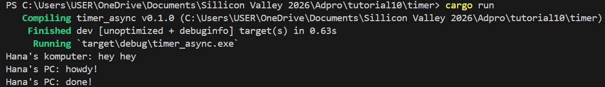
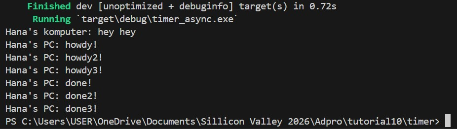
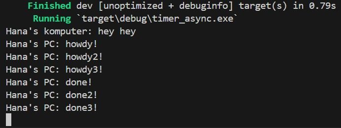

## Reflection

### 1.2 Understanding how it works

Dari potongan output tersebut, terlihat bahwa fungsi async akan berjalan diluar fungsi utama. Hal ini menjadi alasan kenapa "Hana's komputer: hey hey" berjalan lebih dahulu dibanding dua pesan lainnya yang berada didalam fungsi async. Hal ini dapat terjadi karena fungsi async tersebut masing menunggu hasil dari eksekusi dari future
### 1.3 Multiple Spawn and removing drop
- Sebelum menghapus kode `drop(spawner);`

- Setelah menghapus kode `drop(spawner);`

Potongan output diatas terjadi saat kode `drop(spawner);` dimatikan. Dalam kasus diimplementasikannya multiple spawn, akan  lebih banyak task yang masuk kedalam task sender dimana task tersebut akan diberlakukan seperti sebuah message queue. Saat kode `drop(spawner);` tersebut dimatikan, program akan terus berjalan karena menganggap bahwa masih akan terjadi pengiriman data yang dilakukan oleh spawner. Oleh karena itu, kode `drop(spawner);` perlu diimplementasikan guna menandakan interaksi sudah selesai dan spawner akan ditutup.